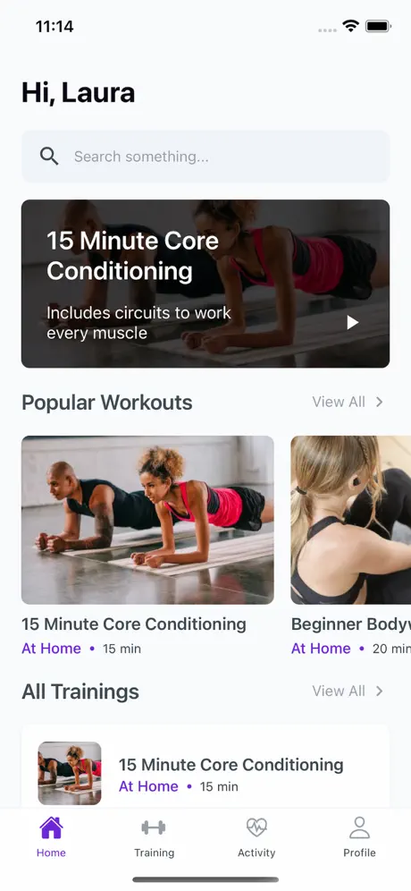
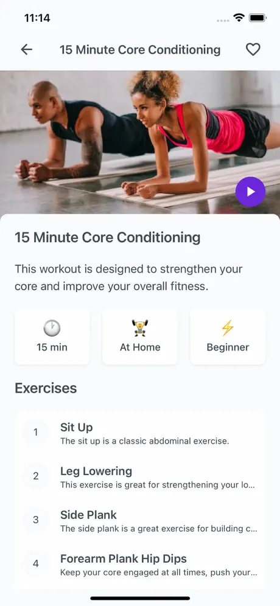
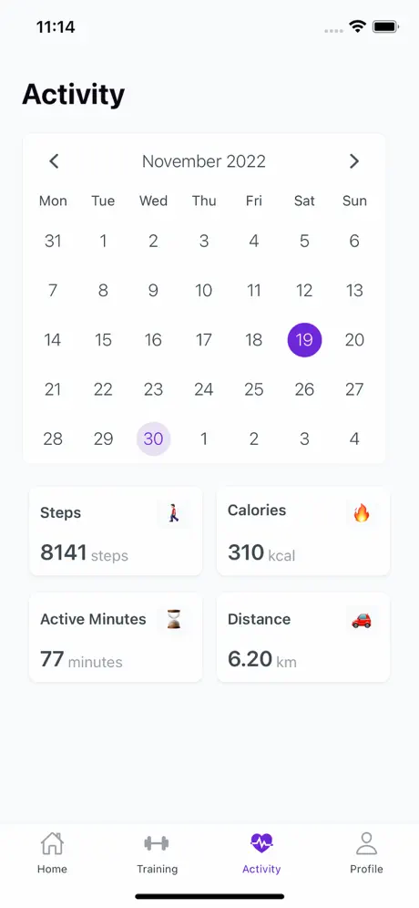
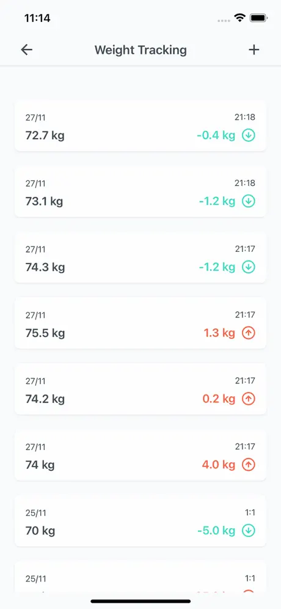
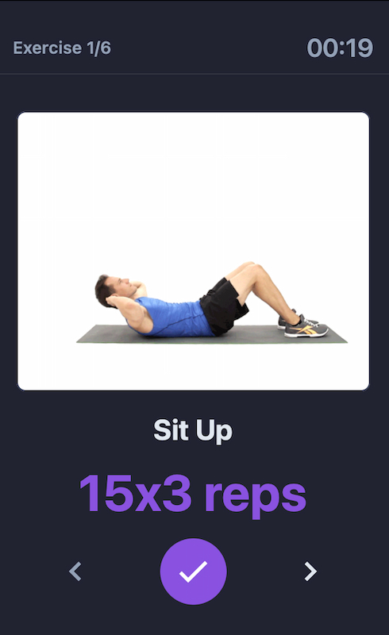

<h1>Fitcare</h1>

React Native Fitness App | Free & Open Source

<h2>About the Project</h2>

Fitcare is a free and open source React Native mobile application that provides fitness, health and exercise tracking. It is a mobile application developed using React Native and Firebase that includes weight tracking, exercise tracking, fitness training, Google Fit and Apple Healthkit integrations.

View Screenshots

 

<h3>Technologies</h3>
<ul>
<li><a href="https://reactnative.dev/">React Native</a></li>
<li><a href="https://firebase.google.com/">Firebase</a></li>
<li><a href="https://www.google.com/fit/">Google Fit Integration</a></li>
<li><a href="https://developer.apple.com/documentation/healthkit">Apple HealthKit Integration</a></li>
</ul>
